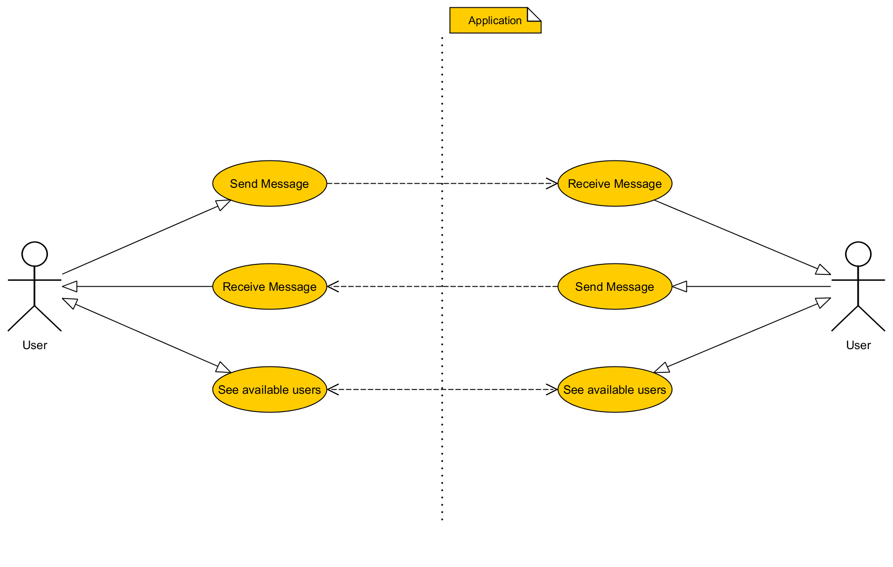
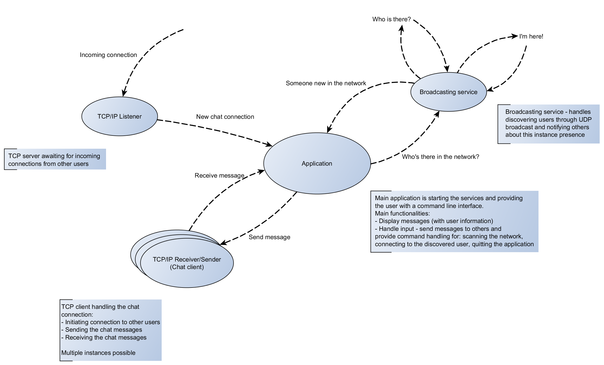
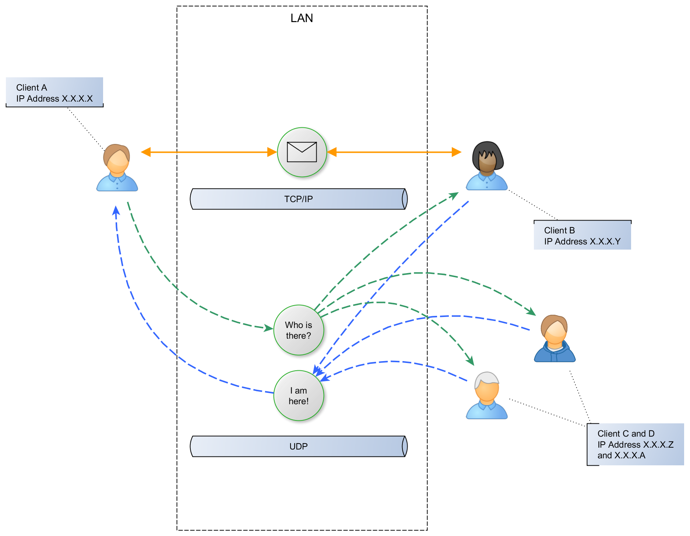

# Local network chat application
## Overview
Let's consider an application that will let users communicate with each other over the local area network. The application will provide the messaging service through a command line interface and will link the peers via TCP/IP. The users will be able to scan the network in search for available people (other users running the application) and connect to them in a peer to peer fashion.
### Use case
A user of the application should be able to perform three actions:
- Send a message to the other user
- Receive a message from the other user, and
- See available users

## Requirements
### Application requirements
The application should work in a multi-threaded fashion, allowing mutliple connections to be open simultaneously so that the user can communicate with multiple other users through individual TCP/IP connections. The application needs to start the TCP/IP listener for incoming connections and launch a chat client instance for each of the new connections. A broadcasting service will be needed to support the user's discovery feature where the service is periodically sending a broadcast UDP packet to all devices available in the local network (asking "who is there?") and is handling the replies (other instances of the application in the network are replying "I'm here"). The application should provide a simple command line interface displaying the messages from other users, and allow them to type in and send messages to others. Also simple commands like: scan the network, connect to a chat or quit the application, should be added.

### Network traffic
The idea is that the application will use a TCP connection for transporting messages between the peers because the TCP protocol will assure that the message is delivered to the other user. The application will also use a UDP connection for periodic (or on demand) broadcasting to search for other users available in the network. The broadcast service will provide a reply mechanism to register the available users within the application, starting with their name and IP address.

## Protocol definition
### TCP/IP messaging protocol
to be decided

### Broadcast protocol
to be decided

Draft: 
#### Commands and structure
UDP Command structure:
[PROTOCOL_VERSION][COMMAND][PAYLOAD_LENGTH][PAYLOAD][CHECKSUM]
- Protocol version - as an 8bit unsigned integer
- Command - as an 8bit unsigned integer
- Payload length - as a 16bit unsigned integer
- Payload - of length specified in "Payload length"
- Checksum - as a 32bit unsigned integer

Payload types:
- STRING - string length as 16bit unsigned integer followed by the string byte array: [UINT16][STRING_OF_CHARACTERS]
- UINT32 - 4 bytes long unsigned integer 

Two commands: WHO_IS_THERE and I_AM_HERE 
#### Command WHO_IS_THERE
No payload, send on broadcast IP address.
#### Command I_AM_HERE
Payload: [User name as STRING][IP Address as UINT32]

